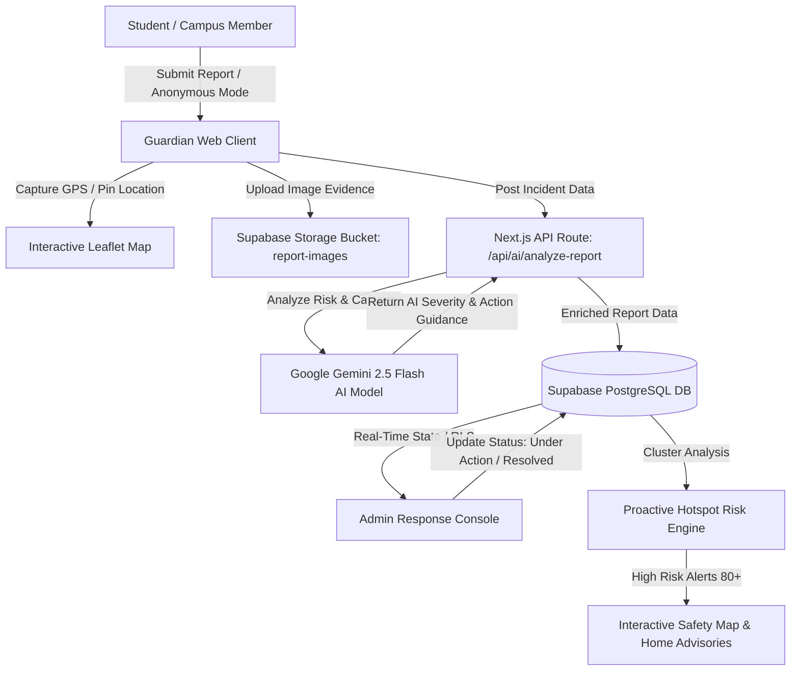

# 🛡️ Guardian — Campus Safety & Incident Reporter

**Guardian** is an intelligent, real-time campus safety and incident reporting platform designed for **Maharishi Markandeshwar University (MMDU), Mullana, Ambala, Haryana, India**. It empowers students, faculty, and administrative safety officers to report physical hazards, lighting outages, harassment, theft, and medical emergencies, while providing AI-driven proactive hotspot advisories and live incident resolution tracking.

---

## 📋 Table of Contents

- [Overview & Architecture](#-overview--architecture)
- [Key Features](#-key-features)
- [Tech Stack](#-tech-stack)
- [Project Structure](#-project-structure)
- [Prerequisites](#-prerequisites)
- [Environment Variables Setup](#-environment-variables-setup)
- [Database & Storage Setup (Supabase)](#-database--storage-setup-supabase)
- [Installation & Local Setup](#-installation--local-setup)
- [AI Safety Intelligence Workflow](#-ai-safety-intelligence-workflow)
- [User Roles & Permissions](#-user-roles--permissions)
- [Scripts Reference](#-scripts-reference)
- [Troubleshooting](#-troubleshooting)

---

## 🌟 Overview & Architecture

Guardian connects campus members directly with public safety dispatchers and facilities maintenance teams. Built with Next.js 14, Supabase, and Google Gemini AI, Guardian transforms raw incident submissions into actionable safety intelligence.



---

## ✨ Key Features

### 1. 🚨 Campus Incident Submission (`/report`)
- **Category Selection**: Physical Hazard, Lighting Outage, Suspicious Activity, Theft/Property, Harassment/Safety, Medical Emergency, or General Safety.
- **Geographic Pinning**: Interactive Leaflet map location picker, landmark preset selection, or browser GPS auto-detection (`navigator.geolocation`).
- **Privacy & Anonymity**: Toggleable **Anonymous Mode** that hides user identity from security dispatchers and public logs.
- **Media Evidence**: Upload photo attachments directly to Supabase Storage.

### 2. 🗺️ Interactive Safety & Proactive Risk Map (`/map`)
- Dynamic map rendered via Leaflet & React-Leaflet.
- Severity-coded markers (**Emergency**, **High**, **Medium**, **Low**, and **Resolved**).
- Dynamic multi-filter bar by search keyword, category, status, and priority level.
- Interactive incident drawer displaying photo evidence, AI intelligence notes, and administrative resolution logs.

### 3. 🤖 AI Safety Intelligence Engine
- Automatic incident analysis powered by **Google Gemini 2.5 Flash API** (`/api/ai/analyze-report`).
- Normalizes categories, calculates AI risk severity, and generates dispatch advice.
- Built-in campus-tailored heuristic fallback mechanism for resilient operation.

### 4. 🔥 Dynamic Proactive Hotspot Detection (`lib/hotspotAnalyzer.ts`)
- Algorithmic spatial clustering of reports around campus landmarks (Central Library, Student Hostels, Engineering Block, Medical College, Sports Complex).
- Computes dynamic location risk scores (0–100 scale).
- Triggers high-risk advisories (Score 80+) with peak hour warnings and recommended safety precautions.

### 5. 🛡️ Admin Response Console (`/admin`)
- Role-gated dashboard for campus safety officers and dispatchers.
- Real-time incident response queue with search & status filters.
- Admin action assignment (e.g., *Deploy security escort patrol*, *Dispatch electrical repair*, *Cordon off hazard area*).
- Status workflow transitions: `reported` ➔ `under_review` ➔ `under_action` ➔ `resolved`.

### 6. 🔐 Supabase Authentication & RBAC
- Supported Auth methods: Email/Password authentication & Google OAuth (`/auth/callback`).
- PostgreSQL Row Level Security (RLS) policies protecting user profiles and admin operations.
- Automatic profile provisioning trigger (`handle_new_user`) upon sign-up.

---

## 🛠️ Tech Stack

| Layer | Technology |
| :--- | :--- |
| **Frontend Framework** | [Next.js 14](https://nextjs.org/) (App Router, Server & Client Components) |
| **Language** | [TypeScript](https://www.typescriptlang.org/) |
| **Styling** | [Tailwind CSS](https://tailwindcss.com/), PostCSS, Autoprefixer, [Lucide React](https://lucide.dev/) |
| **Database & Auth** | [Supabase](https://supabase.com/) (PostgreSQL, Supabase Auth `@supabase/ssr`, Row Level Security) |
| **Storage** | Supabase Storage (`report-images` public bucket) |
| **Mapping Library** | [Leaflet](https://leafletjs.com/) & [React-Leaflet](https://react-leaflet.js.org/) |
| **AI / LLM** | [Google Gemini API](https://ai.google.dev/) (`gemini-2.5-flash`) |

---

## 📁 Project Structure

```
Guardian/
├── .env                        # Environment variables template
├── next.config.mjs             # Next.js configuration
├── package.json                # Project dependencies and npm scripts
├── postcss.config.js           # PostCSS setup
├── tailwind.config.ts          # Tailwind styling configuration
├── tsconfig.json               # TypeScript compiler config
├── supabase/
│   └── schema.sql              # PostgreSQL tables, RLS policies, trigger & storage bucket setup
└── src/
    ├── app/
    │   ├── admin/
    │   │   └── page.tsx        # Admin Response Console (/admin)
    │   ├── api/
    │   │   └── ai/
    │   │       └── analyze-report/
    │   │           └── route.ts # Gemini AI Safety Intelligence API Route
    │   ├── auth/
    │   │   ├── callback/
    │   │   │   └── route.ts    # Supabase OAuth callback route
    │   │   └── page.tsx        # Auth Sign In / Sign Up page (/auth)
    │   ├── dashboard/
    │   │   └── page.tsx        # Student Dashboard overview (/dashboard)
    │   ├── map/
    │   │   └── page.tsx        # Interactive Safety Map page (/map)
    │   ├── my-reports/
    │   │   └── page.tsx        # User's report tracking page (/my-reports)
    │   ├── report/
    │   │   └── page.tsx        # Campus Incident Submission page (/report)
    │   ├── globals.css         # Global CSS & Tailwind imports
    │   ├── layout.tsx          # Root app layout with Toast & Safety Providers
    │   └── page.tsx            # Main Landing / Home page (/)
    ├── components/
    │   ├── layout/             # Navbar, Footer, Sidebar navigation components
    │   ├── map/                # Dynamic SafetyMapComponent (Leaflet)
    │   └── ui/                 # Reusable UI primitives (Button, Card, Badge, Modal, Toast)
    └── lib/
        ├── hotspotAnalyzer.ts  # Proactive Hotspot Clustering & Risk Scoring Algorithm
        ├── mockData.ts         # Pre-populated campus location landmarks & sample fallback data
        ├── store.tsx           # Global React Safety Context & Supabase state synchronization
        ├── types.ts            # Core TypeScript interfaces & types
        └── supabase/
            ├── client.ts       # Supabase browser client factory
            └── server.ts       # Supabase server client factory
```

---

## ⚙️ Prerequisites

Ensure you have the following installed on your local machine:
- **Node.js**: `v18.x` or higher (Recommended: Node 20 LTS)
- **npm**: `v9.x` or higher (comes bundled with Node.js)
- **Supabase Account**: A free Supabase project at [supabase.com](https://supabase.com)
- **Google Gemini API Key**: Obtainable from [Google AI Studio](https://aistudio.google.com/apikey)

---

## 🔑 Environment Variables Setup

Create a `.env` (or `.env.local`) file in the project root directory and add the following keys:

```env
# ===========================================
# Guardian - Campus Safety Reporter
# Environment Variables
# ===========================================

# Supabase Configuration
# Dashboard -> Project Settings -> API
NEXT_PUBLIC_SUPABASE_URL=https://your-supabase-project-id.supabase.co
NEXT_PUBLIC_SUPABASE_ANON_KEY=your-supabase-anon-key

# Gemini AI API Key (for AI Safety Intelligence)
# Get from: https://aistudio.google.com/apikey
GEMINI_API_KEY=your-gemini-api-key
```

> **Note**: `NEXT_PUBLIC_` variables are exposed to the browser. `GEMINI_API_KEY` is securely accessed on the server-side Next.js API route (`/api/ai/analyze-report`).

---

## 🗄️ Database & Storage Setup (Supabase)

1. Open your Supabase Dashboard: [https://supabase.com/dashboard](https://supabase.com/dashboard)
2. Navigate to the **SQL Editor** tab.
3. Paste the contents of `supabase/schema.sql` into the query editor and click **Run**.

This script will automatically:
- Enable the `pgcrypto` extension for UUID generation.
- Create the **`public.profiles`** table for user profile records.
- Create the **`public.reports`** table for safety reports and AI metadata.
- Create helper security function **`public.is_admin()`**.
- Configure **Row Level Security (RLS)** policies for profiles, reports, and public safety viewing.
- Create the **`report-images`** public storage bucket with upload policies.
- Set up an automated database trigger (`on_auth_user_created`) to auto-create user profiles upon sign-up.

---

## 🚀 Installation & Local Setup

1. **Clone or navigate to the project repository**:
   ```bash
   cd c:\Users\SmritiJha\Desktop\Guardian
   ```

2. **Install project dependencies**:
   ```bash
   npm install
   ```

3. **Run the development server**:
   ```bash
   npm run dev
   ```

4. **Access the application**:
   Open your browser and navigate to `http://localhost:3000`.

---

## 🤖 AI Safety Intelligence Workflow

When a user submits a report:
1. The client sends incident title, category, description, and location to `/api/ai/analyze-report`.
2. The endpoint queries Google Gemini (`gemini-2.5-flash`) with structured prompts tailored for **MMDU Mullana**.
3. Gemini returns a structured JSON response containing:
   - `ai_severity`: `'low' | 'medium' | 'high'`
   - `ai_category`: Normalized safety category
   - `ai_risk_reason`: Concise analysis and dispatch advice for security officers.
4. If the Gemini API call is unreachable or fails, Guardian seamlessly falls back to an internal **Heuristic Campus Safety AI Analyzer** tailored to university keyword indicators.

---

## 👤 User Roles & Permissions

| Feature | Student Role | Admin Role |
| :--- | :---: | :---: |
| Submit Incident Reports | ✅ | ✅ |
| Anonymous Reporting Mode | ✅ | ✅ |
| View Interactive Safety Map | ✅ | ✅ |
| View My Submitted Reports | ✅ | ✅ |
| Access Admin Response Console (`/admin`) | ❌ | ✅ |
| Assign Response Actions & Notes | ❌ | ✅ |
| Update Status (`under_action`, `resolved`) | ❌ | ✅ |
| Delete Incident Reports | Owner Only | ✅ All Reports |

> **Simulator Tip**: You can quickly test Admin capabilities by toggling your role to **Admin** via the navigation toolbar or using an admin account configured in `profiles`.

---

## 📜 Scripts Reference

In `package.json`, the following scripts are available:

- `npm run dev` — Starts the Next.js development server on `http://localhost:3000`.
- `npm run build` — Builds the application for production deployment.
- `npm run start` — Starts the Next.js production server.
- `npm run lint` — Runs ESLint checks across the codebase.

---

## ❓ Troubleshooting

- **Leaflet Map Not Rendering / Grid Missing Tiles**:
  Make sure Leaflet CSS is imported. The map components use dynamic client-side imports (`ssr: false`) to avoid server-side window rendering errors.
- **Supabase Connection Issues**:
  Verify `NEXT_PUBLIC_SUPABASE_URL` and `NEXT_PUBLIC_SUPABASE_ANON_KEY` match your Supabase project settings.
- **Image Upload Fails**:
  Ensure the `report-images` storage bucket has been created via `supabase/schema.sql` and that storage policies permit uploads.
- **AI Analysis Returns Fallback**:
  Check that `GEMINI_API_KEY` is set in your `.env` file. If using a custom model endpoint, verify Google AI Studio quota limits.

---

<p align="center">
  Built with ❤️ for <strong>Maharishi Markandeshwar University (MMDU)</strong> Campus Safety & Community Well-Being.
</p>
